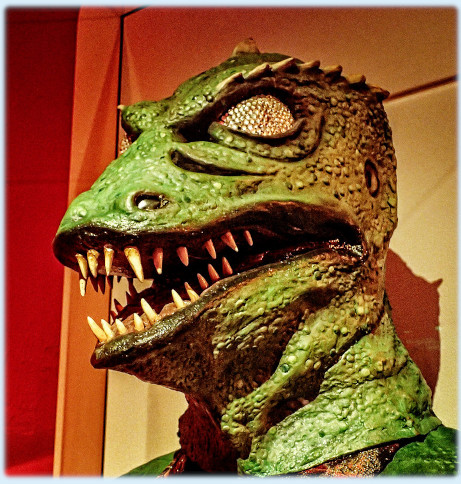

## Welcome to Gorn - the angst-inducingly powerful graph ORM

This project attempts to build a modern TS/decorator-based ORM for ArangoDB.

It will provide @decorators to instantiate Arango
* Nodes (Document collection)
* Edges (Edge collection)
* Graphs (Graph)
* Views (ArangoSearchView)

as well as configuration objects to configure their connectivity & search views.

Best of all, we are introducing behavioral decorators, like
* @Hierarchical (nodes of this type have parents / children & can e.g. lookup their siblings with one method call ;-)
* @Heterarchical nodes (find all friends with certain traits within a distance of *min/max*
* @Bipartite nodes (e.g. @Bipartite({nodes: 'authors', others: 'papers'})
* @Preferences regarding traversal behavior (e.g. @BFS, @DFS or @Closeness({nodes: ['people', 'companies']}))
  
